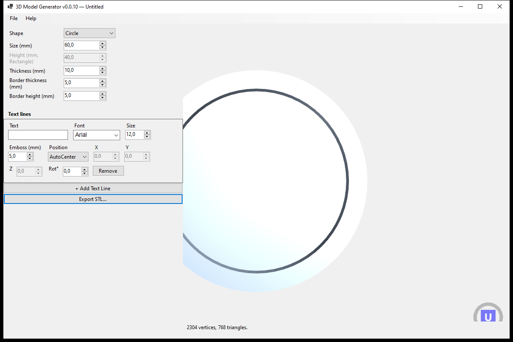
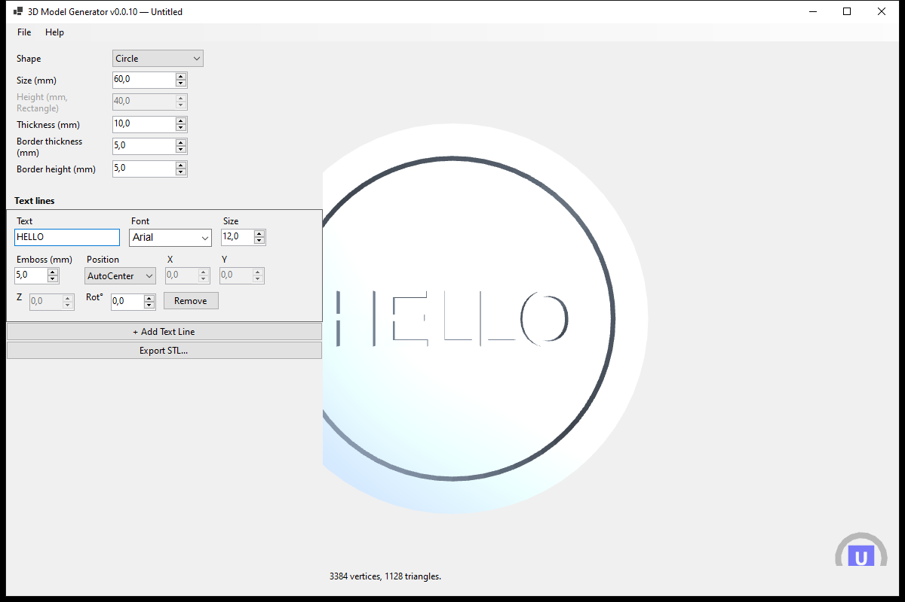
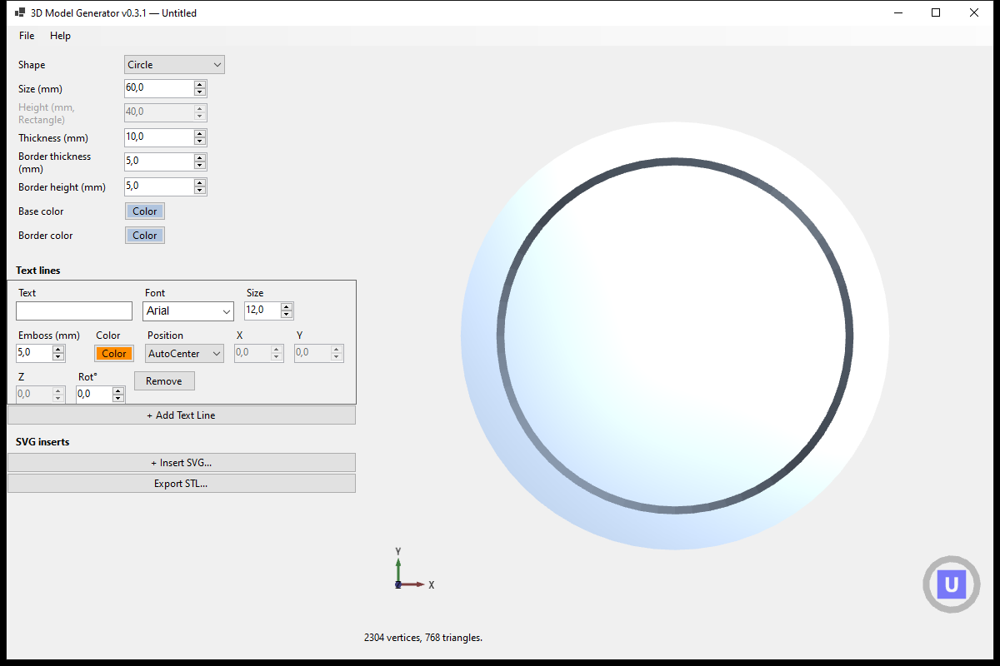
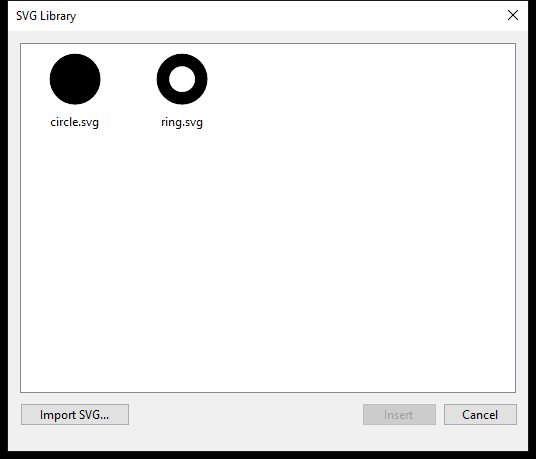
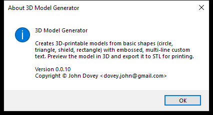

# How to Use 3D Model Generator

This guide walks through creating a simple embossed-text model and exporting it
for 3D printing.

## Launching the app

Run `ModelGenerator.UI.exe` (or `dotnet run --project src/ModelGenerator.UI`).
The main window opens with a default circular shape already previewed in the 3D
viewport on the right:

The window has three parts:
- **Left panel** — shape parameters, text lines, and the Export STL button
- **3D viewport** — a live preview of the model, viewed from directly above
  (drag with the mouse to rotate/orbit; scroll to zoom)
- **Status bar** — shows the current vertex/triangle count, or an error message
  if the current settings can't be generated (e.g. a border thicker than the
  shape itself)

## 1. Choose a shape

Under **Shape**, pick one of:

- **Circle** — set its diameter under **Size (mm)**
- **Rectangle** — set both **Size (mm)** (width) and **Height (mm)**
- **Triangle** — an equilateral triangle; **Size (mm)** sets the side length
- **Shield** — a heraldic-style silhouette; **Size (mm)** sets the top-edge width

Then set:
- **Thickness (mm)** — how thick the flat base is
- **Border thickness (mm)** — how wide the raised rim around the edge is
- **Border height (mm)** — how far that rim is embossed above the base

The 3D preview regenerates automatically every time you change a value.

## 2. Add text

Under **Text lines**, each row is one line of embossed text:

- **Text** — the line's content
- **Font** / **Size** — the font name (drawn in its own typeface in the
  dropdown) and point size
- **Emboss (mm)** — how far this line is raised above the shape's surface
- **Position** — how this line is placed:
  - **AutoCenter** — lines are stacked and centered automatically; this is the
    default and needs no further input
  - **Manual** — type absolute **X**, **Y**, **Z** (height above the base) and
    **Rot°** (rotation) coordinates directly
  - **Relative** — type **X**/**Y** as an offset from the shape's center, and
    **Z** as an air-gap above the shape's surface; recalculates if the shape is
    resized

Click **+ Add Text Line** for more lines — each line can use a different font,
size, and position mode. Click **Remove** on a row to delete it.

**Dragging text in the viewport:** click and drag any line of text directly in
the 3D preview to reposition it — this switches that line to **Manual** mode
and fills in its X/Y/Z automatically. The base shape itself isn't draggable
(dragging it just orbits the camera as usual).

## 3. Choosing colors

Everything in the model can be colored independently:

- **Base color** / **Border color** — under the shape parameters, each opens a
  color picker for the shape's floor and its raised rim
- **Color** on a text line — opens a color picker for just that line
- **Color** on an SVG insert — opens a color picker for just that insert

Colors are saved and reloaded with the model like everything else.

## 4. Inserting SVG graphics

Under **SVG inserts**, click **+ Insert SVG...** to open the library:

- **Import SVG...** copies one or more `.svg` files from disk into the app's
  library (`%LOCALAPPDATA%\ModelGenerator\SvgLibrary`) — they stay available
  for future models
- Select a file (its thumbnail previews the shape, including any holes/cutouts
  it contains) and click **Insert**

The inserted graphic gets its own row, just like a text line:

- **Scale (mm)** — the size along its longer bounding-box dimension
- **Emboss (mm)** — how far it's raised above the shape's surface
- **Color** — its own color picker
- **Position** / **X**/**Y**/**Z**/**Rot°** — same AutoCenter/Manual/Relative
  modes as text lines

**Dragging an SVG insert in the viewport** works the same way as text: click
and drag it directly in the 3D preview to reposition it (switches it to
**Manual** mode). Text lines and SVG inserts drag independently of each other
and of the base shape.

## 5. Save, open, and start a new model

The **File** menu has:

- **New** — resets everything back to the default circle with no text
- **Open...** — lists models previously saved to the local SQLite database;
  select one and click **Open**, or **Delete** to remove it
- **Save** — saves the current model; prompts for a name the first time
- **Save As...** — always prompts for a name and saves as a new model
- **Export STL...** — see below
- **Exit** — closes the app

Saved models (including their generated mesh) live in a local SQLite database at
`%LOCALAPPDATA%\ModelGenerator\models.sqlite`.

## 6. Export to STL

Click **Export STL...** (left panel or File menu) and choose where to save the
`.stl` file. This exports the exact mesh currently shown in the preview, ready
to open in a slicer (PrusaSlicer, Cura, etc.) and print.

## Help and About

**Help → How to Use** opens this guide inside the app. **Help → About** shows
the app's version and copyright:

